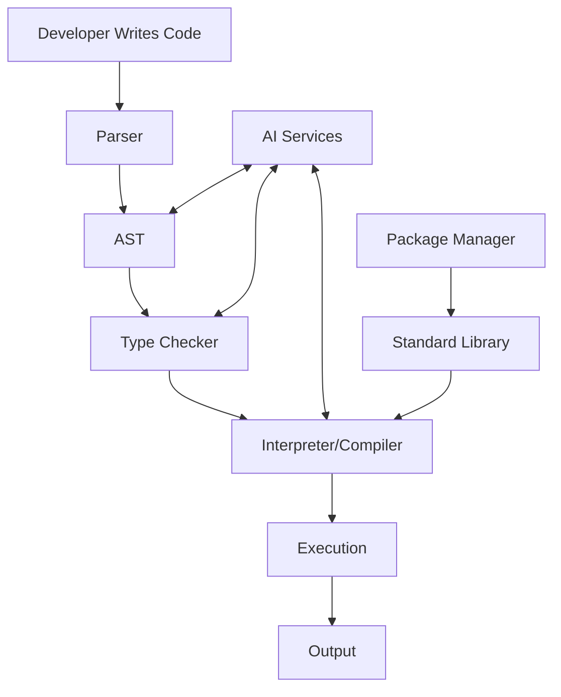

# HyperCode Architecture

This document provides a high-level overview of the HyperCode architecture, its components, and how they interact.

## 🏗️ Core Architecture

### 1. Frontend Layer

- **Web IDE**: Browser-based development environment
- **Desktop App**: Native application with system integration
- **Mobile App**: On-the-go coding and learning

### 2. Language Layer

- **Parser**: Converts HyperCode syntax to AST
- **Interpreter**: Executes HyperCode programs
- **Type Checker**: Validates program correctness
- **Standard Library**: Built-in functions and types

### 3. AI Integration Layer

- **Code Understanding**: Analyzes code structure and intent
- **Code Generation**: Suggests completions and improvements
- **Error Detection**: Identifies potential issues
- **Documentation**: Generates and maintains docs

### 4. Backend Services

- **Compiler/Transpiler**: Converts HyperCode to target languages
- **Package Manager**: Manages dependencies and modules
- **Runtime Environment**: Executes HyperCode programs
- **AI Services**: Hosts language models and APIs

## 🔄 Data Flow

## 🧩 Key Components

### Parser (`/hypercode/parser`)

- Handles syntax analysis
- Converts source code to AST
- Provides meaningful error messages

### Interpreter (`/hypercode/interpreter`)

- Executes AST directly
- Manages variable scope and memory
- Handles control flow

### Type System (`/hypercode/types`)

- Defines type rules
- Performs type inference
- Validates type safety

### Standard Library (`/stdlib`)

- Core functionality
- Data structures
- I/O operations
- AI utilities

## 🛠️ Development Tools

### Testing Framework

- Unit tests
- Integration tests
- Property-based tests
- Performance benchmarks

### Debugger

- Step-through execution
- Variable inspection
- Breakpoints
- Call stack visualization

### Profiler

- Performance analysis
- Memory usage
- Bottleneck identification

## 🌐 Deployment Architecture

### Development

- Local environment setup
- Hot-reloading
- Debugging tools

### Staging

- CI/CD pipeline
- Automated testing
- Performance monitoring

### Production
- Containerized deployment
- Load balancing
- Auto-scaling
- Monitoring and logging

## 🔄 Integration Points

### Version Control
- Git integration
- Code review tools
- CI/CD pipelines

### IDEs and Editors
- VS Code extension
- JetBrains plugin
- Web-based editor

### Cloud Services
- AI model hosting
- Compute resources
- Storage solutions

## 🔄 Data Flow

1. **Code Entry**: Developer writes HyperCode
2. **Analysis**: Parser and type checker validate
3. **Execution**: Interpreter runs the code
4. **Output**: Results displayed to user
5. **Feedback**: AI provides suggestions

## 🏗️ Future Extensions

### Quantum Computing
- Quantum circuit integration
- Hybrid quantum-classical execution

### Visual Programming
- Block-based interface
- Flow-based programming

### Collaborative Features
- Real-time collaboration
- Multi-user editing
- Shared debugging

## 🔍 Security Considerations

- Sandboxed execution
- Input validation
- Secure AI model access
- Data privacy

## 📈 Performance Considerations

- Just-in-time compilation
- Caching strategies
- Parallel execution
- Memory management

---
*Last Updated: December 2025*
