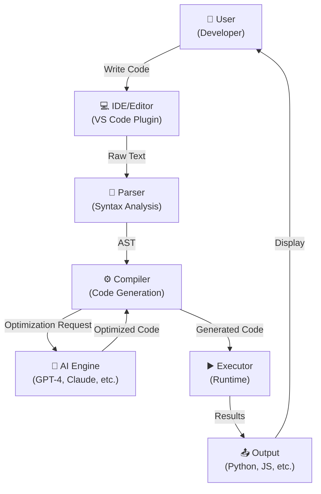
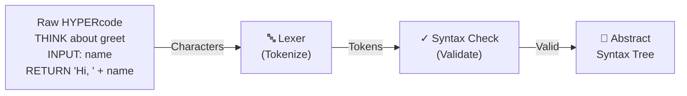
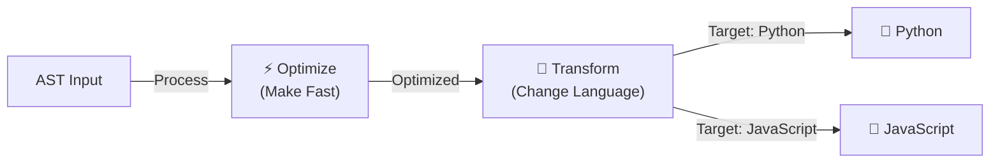
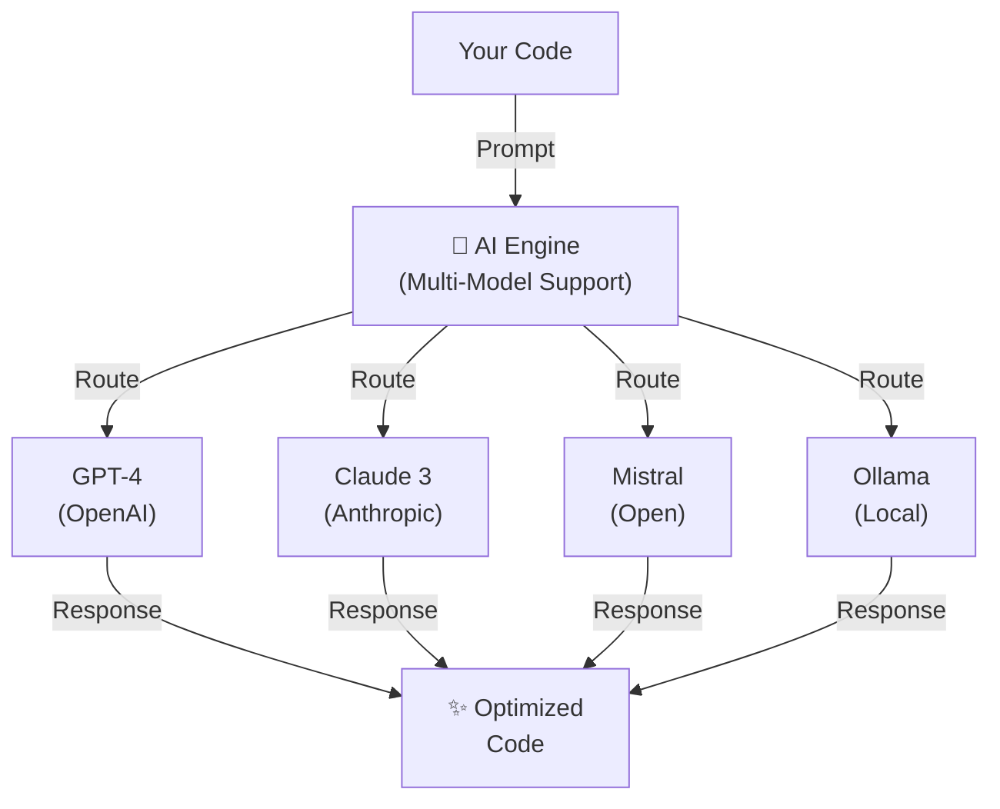
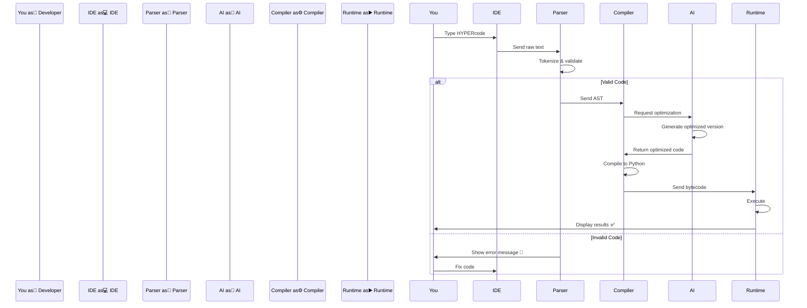
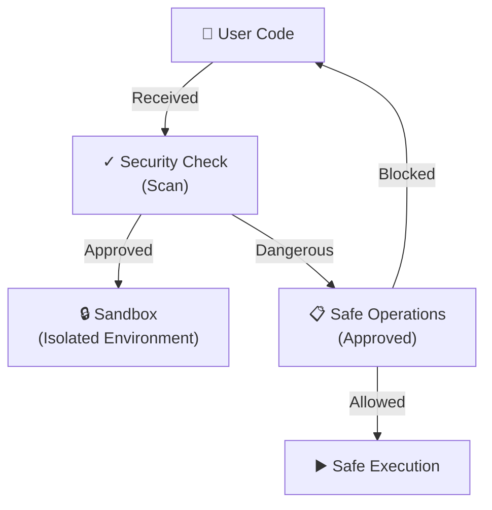
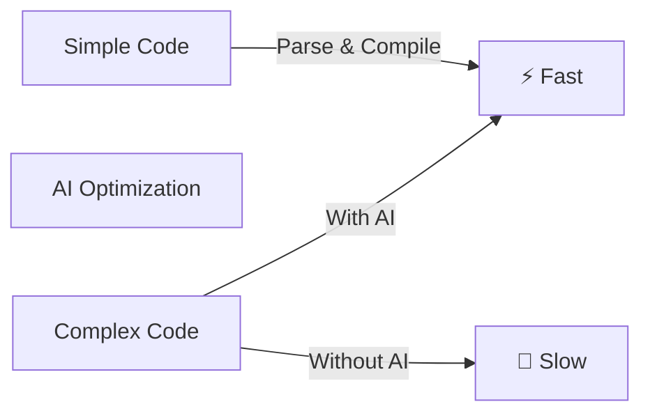
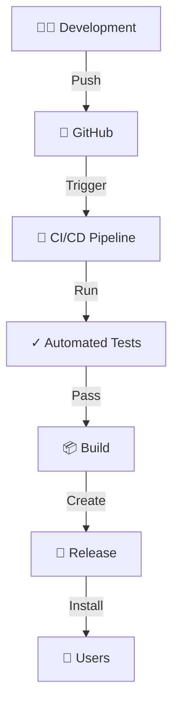
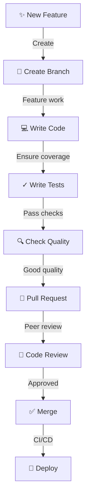

# HYPERcode Architecture - Visual Guide

*Making complex architecture clear for neurodivergent minds*

---

## 🏗️ System Architecture Overview



**What This Shows:**
- **👤 User** starts with an idea
- **💻 IDE** provides a friendly interface
- **📝 Parser** understands the HYPERcode syntax
- **⚙️ Compiler** converts to Python/JavaScript
- **🧠 AI** optimizes for performance
- **▶️ Executor** runs the code
- **📤 Output** shows results

---

## 🧩 Component Breakdown

### 1. **Parser Layer** 📝



**Key Points:**
- ✅ **Lexer** breaks code into tokens
- ✅ **Syntax Checker** validates grammar
- ✅ **AST** represents code structure
- ❌ Clear errors if something's wrong

---

### 2. **Compiler Layer** ⚙️



**Compile Targets:**
- 🐍 **Python** - Great for data science
- 📜 **JavaScript** - Runs in browsers
- 🚀 **Future** - WASM, Go, Rust

---

### 3. **AI Integration Layer** 🧠



**AI Features:**
- 🔄 **Fallback Support** - If one AI fails, try another
- 🎯 **Smart Routing** - Uses best AI for the task
- 💰 **Cost Aware** - Can choose cheaper options
- 🔐 **Local Option** - Ollama for privacy

---

## 🔄 Data Flow Example

**What happens when you write HYPERcode:**



---

## 📦 Folder Structure

```
HYPERcode/
├── 📁 hypercode/              ← Main package
│   ├── 📁 parser/             ← Parse HYPERcode
│   │   ├── lexer.py           ← Tokenize
│   │   ├── syntax_checker.py  ← Validate
│   │   └── ast_builder.py     ← Create AST
│   │
│   ├── 📁 compiler/           ← Compile to targets
│   │   ├── python_compiler.py ← → Python
│   │   ├── js_compiler.py     ← → JavaScript
│   │   └── optimizer.py       ← Optimize
│   │
│   ├── 📁 ai/                 ← AI integrations
│   │   ├── providers.py       ← GPT-4, Claude, etc.
│   │   ├── prompts.py         ← AI prompts
│   │   └── router.py          ← Choose AI
│   │
│   └── 📁 runtime/            ← Execute code
│       ├── executor.py        ← Run code
│       └── debugger.py        ← Debug mode
│
├── 📁 tests/                  ← Tests
│   ├── 📁 unit/               ← Individual components
│   ├── 📁 integration/        ← Components together
│   └── 📁 e2e/                ← End-to-end
│
├── 📁 docs/                   ← Documentation
│   ├── ARCHITECTURE.md        ← This file
│   ├── GETTING_STARTED.md     ← Quick start
│   └── API.md                 ← API reference
│
└── 📁 .github/                ← CI/CD
    └── 📁 workflows/          ← GitHub Actions
```

---

## 🧠 Design Principles for Neurodivergent Developers

### 1. **Clarity Over Brevity**
```hypercode
❌ WRONG (too terse):
f = lambda x: x*2

✅ RIGHT (clear intent):
THINK about double_number
INPUT: number
OUTPUT: doubled

doubled = number * 2
RETURN doubled
```

### 2. **Visual Structure**
```hypercode
❌ WRONG (cramped):
INPUT: a, b, c OUTPUT: result = a+b+c RETURN result

✅ RIGHT (spaced):
INPUT: a, b, c
OUTPUT: result

result = a + b + c
RETURN result
```

### 3. **No Hidden Behavior**
```hypercode
❌ WRONG (implicit):
x = process(data)

✅ RIGHT (explicit):
THINK about process_data
x = process(data)
COMMENT: Now x contains processed data
```

---

## 🔐 Security Architecture



---

## 📊 Performance Considerations



---

## 🚀 Deployment Architecture



---

## 🧪 Testing Strategy

```
                    100% Coverage
                         ▲
                         │
                         │ ✅ Target
                    ┌────┴────┐
                85% │ Critical │ 90%
                    └────┬────┘
                         │
        Unit Tests ───────┼───── Integration Tests
        (75%)             │      (40%)
                         ├─── E2E Tests (10%)
                         │
                    Neurodivergent
                    Accessibility
                      Tests (NEW)
```

---

## 🛠️ Development Workflow



---

## 📈 Scaling Path

```
Phase 1: MVP (Now)
├─ Core Parser
├─ Basic Compiler
├─ Single AI (GPT-4)
└─ Python target

Phase 2: Expansion (3 months)
├─ Multiple AI models
├─ JavaScript target
├─ Better error messages
└─ IDE plugin

Phase 3: Enterprise (6 months)
├─ TypeScript support
├─ WASM compilation
├─ Performance monitoring
└─ Custom AI fine-tuning

Phase 4: Future (12+ months)
├─ Quantum computing support
├─ DNA computing integration
├─ Neural interface optimization
└─ Collective programming mode
```

---

## 💡 Key Takeaways

| Aspect | Design |
|--------|--------|
| **Parsing** | Clear, token-based, no ambiguity |
| **Compilation** | Multi-target, AI-assisted optimization |
| **AI Integration** | Flexible, fallback-ready, cost-conscious |
| **Execution** | Sandboxed, safe, debuggable |
| **Accessibility** | Neurodivergent-first, minimal noise, maximum clarity |
| **Testing** | Comprehensive, automated, accessible |
| **Security** | Scanning, policy-based, transparent |

---

## 🔗 Related Documents

- [Getting Started Guide](./GETTING_STARTED.md)
- [API Reference](./API.md)
- [Contributing Guide](../CONTRIBUTING.md)
- [Security Policy](../SECURITY.md)

---

**Last Updated:** December 20, 2025  
**Architecture Version:** 1.0  
**Status:** Production-Ready
