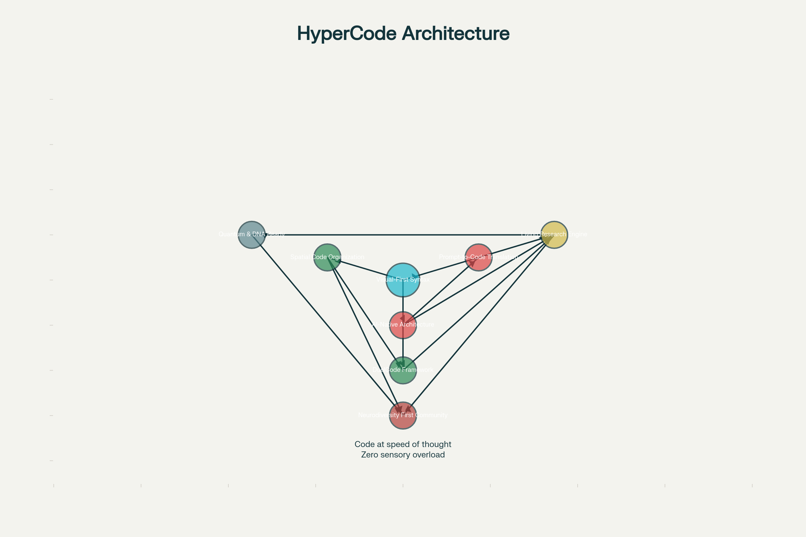

# 🚀 HyperCode - The Neurodivergent-First Programming Language

[](https://opensource.org/licenses/MIT)
[](https://www.python.org/downloads/)
[](tests/)
[](docs/)
[](https://github.com/welshDog/hypercode/discussions)

## 🌟 What is HyperCode?

**HyperCode** is a revolutionary programming language designed with neurodivergent developers in mind. It combines the power of modern programming paradigms with an intuitive syntax that aligns with diverse cognitive patterns.

### 🎯 Core Mission
- **🧠 Neurodivergent-First**: Designed for dyslexic, ADHD, and autistic developers
- **🤖 AI-Augmented**: Built-in support for AI pair programming
- **⚡ High Performance**: Efficient execution with a focus on developer productivity
- **🌍 Open Source**: Community-driven development under MIT License

---
## 🤔 Why HyperCode?

Many languages promise accessibility, but **HyperCode was built from the ground up for neurodivergent minds.**

**Python?** Friendly and readable, but ambiguous syntax can trip up ADHD brains.  
**Blockly?** Great for visual logic, but restricts advanced customization.  
**Rust?** High performance, but the borrow checker melts your brain in hyperfocus mode.

**HyperCode?** Built for neurodivergent flow:
- 🧠 **ADHD-friendly**: Chunked syntax, visual flow indicators
- 📚 **Dyslexia-optimized**: Consistent patterns, minimal cognitive load
- 🎯 **Autism-preferred**: Predictable structures, explicit rules
- 🤖 **AI-augmented**: Real-time feedback and assistance
- 💚 **Emotion-first errors**: Helpful, not scary

**You don't just code—you create with flow.**

### 🏗️ Architecture



*Visual map perfect for spatial thinkers!*


## 🚀 Quick Start


## ⚡ 60-Second Quickstart

**Get HyperCode running NOW:**

**macOS/Linux:**
```bash
curl -sSL https://raw.githubusercontent.com/welshDog/hypercode/main/install.sh | bash
```

**Windows (PowerShell):**
```powershell
iwr https://raw.githubusercontent.com/welshDog/hypercode/main/install.ps1 | iex
```

**Manual Install:**
```bash
git clone https://github.com/welshDog/hypercode.git && cd hypercode
pip install -r requirements.lock
python -m src.hypercode examples/demo_hello.hc
```

🎉 **That's it!** You just ran HyperCode.

> 🟢 **ADHD Tip**: Examples are designed in 5-minute chunks  
> 🔵 **Visual Learners**: Check the architecture diagram below  
> 🟡 **Quick Win**: Try modifying `examples/demo_hello.hc` right now!

---


### Prerequisites
- Python 3.10 or higher
- pip (Python package manager)

- 

### Installation
```bash
# Clone the repository
git clone https://github.com/welshDog/hypercode.git
cd hypercode

# Install dependencies
pip install -r requirements.txt

# Verify installation
python -m src.hypercode --version
```

### Run Your First Program
```bash
# Run the Hello World example
python -m src.hypercode examples/demo_hello.hc
```

---

## 🎯 Key Features

| Feature | Description | Benefit |
|---------|-------------|---------|
| **Dyslexia-Friendly Syntax** | Clean, consistent patterns | Easier reading and writing |
| **ADHD-Optimized Flow** | Focused, distraction-free environment | Better concentration |
| **AI-Augmented** | Built-in AI pair programming | Smarter coding experience |
| **Multi-Paradigm** | Supports multiple programming styles | Flexible development |
| **Comprehensive Tooling** | Everything you need in one place | Faster development |

---

## 📖 Documentation

### Core Documentation
- [Language Specification](docs/LANGUAGE_SPEC.md)
- [Architecture Overview](docs/ARCHITECTURE.md)
- [API Reference](docs/API_REFERENCE.md)
- [Tutorials](docs/TUTORIAL.md)

### Development
- [Contribution Guide](CONTRIBUTING.md)
- [Development Setup](docs/DEVELOPMENT.md)
- [Testing](tests/README.md)
- [Code Style Guide](docs/STYLE_GUIDE_DRAFT.md)

### Research & Design
- [Research Roadmap](docs/research/RESEARCH_ROADMAP.md)
- [Design Principles](docs/DESIGN_PRINCIPLES.md)
- [Accessibility Guidelines](docs/ACCESSIBILITY.md)

---

## 🛠️ Project Structure

```
hypercode/
├── src/                    # Source code
│   ├── core/              # Core language implementation
│   ├── hypercode/         # Main package
│   └── utils/             # Utility functions
├── tests/                 # Test suite
├── examples/              # Example programs
├── docs/                  # Documentation
└── scripts/               # Build and utility scripts
```

---

## 🤝 Contributing

We welcome contributions from everyone! Here's how you can help:

1. **Report bugs**: [Open an issue](https://github.com/welshDog/hypercode/issues)
2. **Fix issues**: Check out our [good first issues](https://github.com/welshDog/hypercode/contribute)
3. **Add features**: Follow our [development guide](docs/DEVELOPMENT.md)
4. **Improve docs**: Help us make our documentation better

Please read our [Contribution Guidelines](CONTRIBUTING.md) for details on our code of conduct and the process for submitting pull requests.

---

## 🚀 Roadmap

### Phase 1: Core Language (✓ Complete)
- [x] Lexer and Pser
- [x] Basic Interpreter
- [x] Core Language Features

### Phase 2: Developer Experience (In Progress)
- [ ] Enhanced IDE Support
- [ ] Debugging Tools
- [ ] Performance Optimization

### Phase 3: Ecosystem (Planned)
- [ ] Package Manager
- [ ] Standard Library
- [ ] Community Packages

---

## 📄 License

This project is licensed under the MIT License - see the [LICENSE](LICENSE) file for details.

## 🙏 Acknowledgments

- All contributors who have helped shape HyperCode
- The neurodivergent community for their invaluable feedback
- Open source projects that made this possible

---

💡 **Pro Tip**: Check out our [Quick Start Guide](examples/QUICK_START.md) for a guided tour of HyperCode's features!

[](https://github.com/welshDog/hypercode#-quick-start)
